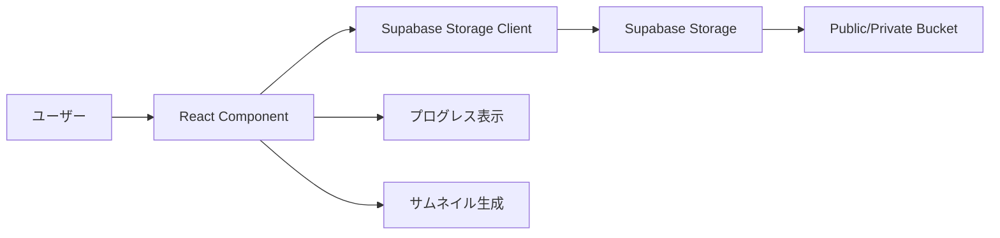

# ファイルアップロード機能 システム設計書

## 1. 概要

本ドキュメントは、Supabase Storageを使用したファイルアップロード機能の設計仕様を定義します。この機能はフロントエンド（`/web`）内で完結し、バックエンドAPIの実装を必要としません。

## 2. アーキテクチャ

### 2.1 技術スタック
- **ストレージ**: Supabase Storage
- **フロントエンド**: Next.js 15.3.4 + React
- **認証**: Supabase Auth（既存）
- **UIライブラリ**: shadcn/ui（既存）
- **フォーム処理**: React Hook Form（既存）

### 2.2 データフロー



## 3. 機能要件

### 3.1 基本機能
- ドラッグ&ドロップによるファイルアップロード
- ファイル選択ダイアログによるアップロード
- 複数ファイルの一括アップロード
- アップロード進捗の表示
- ファイルサイズ制限（デフォルト: 10MB/ファイル）
- ファイルタイプ制限（画像、PDF、ドキュメント）

### 3.2 高度な機能
- 画像のクライアントサイドリサイズ
- サムネイル自動生成
- ファイルのプレビュー機能
- アップロード済みファイルの管理（一覧、削除）
- 共有リンクの生成

## 4. Supabase Storage設定

### 4.1 バケット構成

```typescript
// バケット構造
const buckets = {
  // プロフィール画像用（公開）
  'profile-images': {
    public: true,
    fileSizeLimit: 5 * 1024 * 1024, // 5MB
    allowedMimeTypes: ['image/jpeg', 'image/png', 'image/webp']
  },
  
  // ユーザードキュメント用（プライベート）
  'user-documents': {
    public: false,
    fileSizeLimit: 10 * 1024 * 1024, // 10MB
    allowedMimeTypes: ['application/pdf', 'application/msword', 'text/plain']
  },
  
  // 一般的なファイル用（プライベート）
  'user-files': {
    public: false,
    fileSizeLimit: 50 * 1024 * 1024, // 50MB
    allowedMimeTypes: ['*'] // すべてのファイルタイプ
  }
}
```

### 4.2 RLS（Row Level Security）ポリシー

```sql
-- profile-images バケットのポリシー
CREATE POLICY "プロフィール画像は誰でも閲覧可能"
ON storage.objects FOR SELECT
USING (bucket_id = 'profile-images');

CREATE POLICY "認証ユーザーは自分のプロフィール画像をアップロード可能"
ON storage.objects FOR INSERT
WITH CHECK (
  bucket_id = 'profile-images' AND
  auth.uid()::text = (storage.foldername(name))[1]
);

CREATE POLICY "ユーザーは自分のプロフィール画像を削除可能"
ON storage.objects FOR DELETE
USING (
  bucket_id = 'profile-images' AND
  auth.uid()::text = (storage.foldername(name))[1]
);

-- user-documents バケットのポリシー
CREATE POLICY "ユーザーは自分のドキュメントのみ閲覧可能"
ON storage.objects FOR SELECT
USING (
  bucket_id = 'user-documents' AND
  auth.uid()::text = (storage.foldername(name))[1]
);

CREATE POLICY "認証ユーザーは自分のフォルダにドキュメントをアップロード可能"
ON storage.objects FOR INSERT
WITH CHECK (
  bucket_id = 'user-documents' AND
  auth.uid()::text = (storage.foldername(name))[1]
);

CREATE POLICY "ユーザーは自分のドキュメントを削除可能"
ON storage.objects FOR DELETE
USING (
  bucket_id = 'user-documents' AND
  auth.uid()::text = (storage.foldername(name))[1]
);
```

## 5. 実装詳細

### 5.1 ディレクトリ構造

```
/web/src/
├── lib/
│   └── storage/
│       ├── client.ts          # Supabase Storage クライアント
│       ├── upload.ts          # アップロード関数
│       ├── utils.ts           # ユーティリティ関数
│       └── types.ts           # 型定義
├── hooks/
│   ├── use-file-upload.ts    # ファイルアップロードフック
│   └── use-storage-list.ts   # ファイル一覧取得フック
└── components/
    └── file-upload/
        ├── file-upload-zone.tsx      # ドロップゾーンコンポーネント
        ├── file-upload-progress.tsx  # 進捗表示コンポーネント
        ├── file-preview.tsx          # プレビューコンポーネント
        ├── file-list.tsx             # ファイル一覧コンポーネント
        └── image-resizer.tsx         # 画像リサイズコンポーネント
```

### 5.2 主要な型定義

```typescript
// types.ts
export interface UploadOptions {
  bucket: 'profile-images' | 'user-documents' | 'user-files';
  folder?: string;
  maxFileSize?: number;
  allowedTypes?: string[];
  resize?: ImageResizeOptions;
  onProgress?: (progress: number) => void;
  onComplete?: (url: string) => void;
  onError?: (error: Error) => void;
}

export interface ImageResizeOptions {
  maxWidth: number;
  maxHeight: number;
  quality: number;
  format?: 'jpeg' | 'png' | 'webp';
}

export interface UploadedFile {
  id: string;
  name: string;
  size: number;
  type: string;
  url: string;
  thumbnailUrl?: string;
  uploadedAt: Date;
  bucket: string;
  path: string;
}

export interface FileUploadError {
  code: 'FILE_TOO_LARGE' | 'INVALID_TYPE' | 'UPLOAD_FAILED' | 'NETWORK_ERROR';
  message: string;
  details?: any;
}
```

### 5.3 Supabase Storage クライアント

```typescript
// client.ts
import { createBrowserClient } from '@supabase/ssr';

export const getStorageClient = () => {
  const supabase = createBrowserClient(
    process.env.NEXT_PUBLIC_SUPABASE_URL!,
    process.env.NEXT_PUBLIC_SUPABASE_ANON_KEY!
  );
  
  return supabase.storage;
};
```

### 5.4 カスタムフック実装例

```typescript
// use-file-upload.ts
import { useState, useCallback } from 'react';
import { uploadFile } from '@/lib/storage/upload';
import type { UploadOptions, UploadedFile, FileUploadError } from '@/lib/storage/types';

export const useFileUpload = (options: UploadOptions) => {
  const [isUploading, setIsUploading] = useState(false);
  const [progress, setProgress] = useState(0);
  const [uploadedFiles, setUploadedFiles] = useState<UploadedFile[]>([]);
  const [errors, setErrors] = useState<FileUploadError[]>([]);

  const upload = useCallback(async (files: FileList | File[]) => {
    setIsUploading(true);
    setProgress(0);
    setErrors([]);

    const fileArray = Array.from(files);
    const results = await Promise.allSettled(
      fileArray.map((file) => 
        uploadFile(file, {
          ...options,
          onProgress: (p) => {
            setProgress(p);
            options.onProgress?.(p);
          }
        })
      )
    );

    const uploaded: UploadedFile[] = [];
    const errors: FileUploadError[] = [];

    results.forEach((result, index) => {
      if (result.status === 'fulfilled') {
        uploaded.push(result.value);
      } else {
        errors.push({
          code: 'UPLOAD_FAILED',
          message: `Failed to upload ${fileArray[index].name}`,
          details: result.reason
        });
      }
    });

    setUploadedFiles(prev => [...prev, ...uploaded]);
    setErrors(errors);
    setIsUploading(false);

    return { uploaded, errors };
  }, [options]);

  const removeFile = useCallback(async (fileId: string) => {
    // 実装...
  }, []);

  return {
    upload,
    removeFile,
    isUploading,
    progress,
    uploadedFiles,
    errors
  };
};
```

## 6. UIコンポーネント

### 6.1 ファイルアップロードゾーン

```tsx
// file-upload-zone.tsx
interface FileUploadZoneProps {
  onFilesSelected: (files: FileList) => void;
  accept?: string;
  multiple?: boolean;
  maxFiles?: number;
  disabled?: boolean;
}
```

### 6.2 プログレス表示

```tsx
// file-upload-progress.tsx
interface FileUploadProgressProps {
  fileName: string;
  progress: number;
  status: 'uploading' | 'complete' | 'error';
  error?: string;
}
```

## 7. セキュリティ考慮事項

### 7.1 クライアントサイド
- ファイルタイプの検証（MIME type + 拡張子）
- ファイルサイズの事前チェック
- 悪意のあるファイル名のサニタイズ
- XSS対策（ファイル名表示時のエスケープ）

### 7.2 Supabase側
- RLSによるアクセス制御
- バケットレベルでのファイルサイズ制限
- ユーザーごとのストレージクォータ管理（今後実装）

## 8. パフォーマンス最適化

### 8.1 画像最適化
- クライアントサイドでの画像リサイズ
- WebP形式への自動変換オプション
- Progressive JPEGの生成

### 8.2 アップロード最適化
- チャンク分割アップロード（大容量ファイル対応）
- 並列アップロード制限（最大3ファイル同時）
- リトライ機能（ネットワークエラー時）

## 9. エラーハンドリング

### 9.1 エラーパターン
- ネットワークエラー
- 認証エラー
- ファイルサイズ超過
- 不正なファイルタイプ
- ストレージ容量不足

### 9.2 ユーザーフィードバック
- エラーメッセージの日本語化
- 具体的な解決方法の提示
- リトライボタンの表示

## 10. 今後の拡張予定

### Phase 1（基本実装）
- 基本的なアップロード機能
- プログレス表示
- ファイル一覧表示

### Phase 2（高度な機能）
- 画像エディター統合
- ファイルのバージョン管理
- 共有機能の実装
- ファイルタグ付け機能

### Phase 3（エンタープライズ機能）
- チーム共有フォルダ
- アクセス権限の細分化
- 監査ログ
- ストレージ分析ダッシュボード

## 11. 実装スケジュール

1. **Week 1**: 基本アップロード機能の実装
2. **Week 2**: UI/UXコンポーネントの作成
3. **Week 3**: エラーハンドリングとテスト
4. **Week 4**: ドキュメント作成とデモ実装