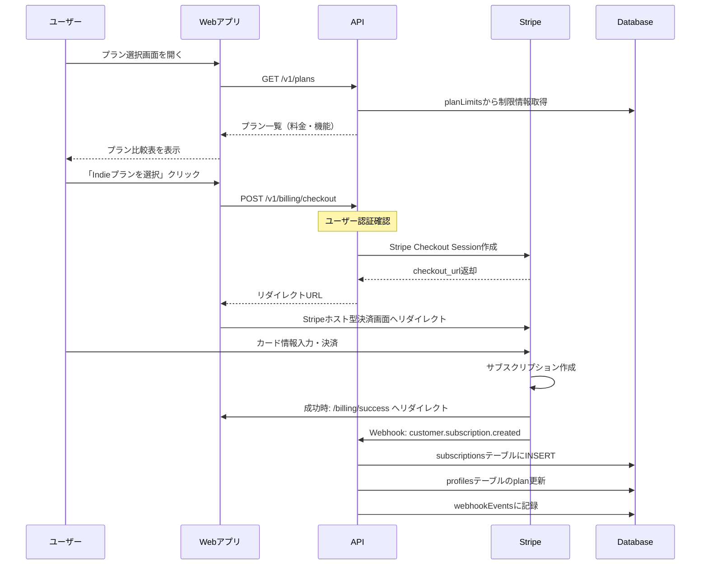
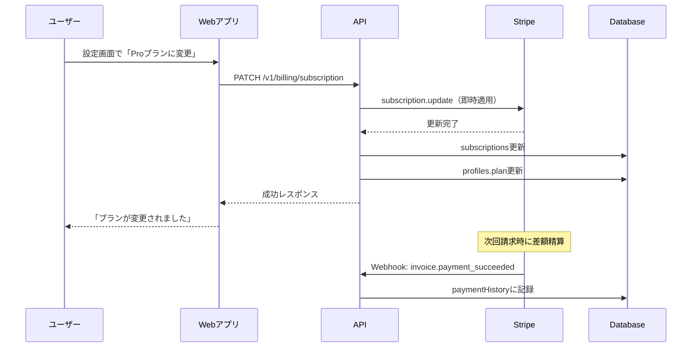
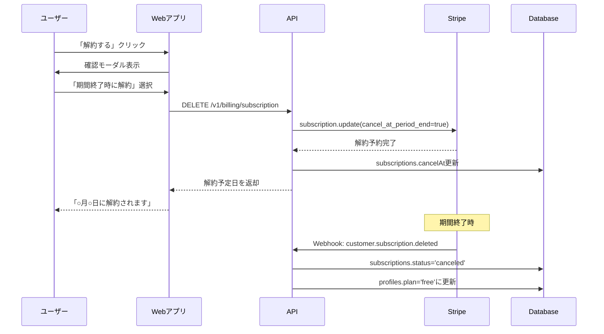

# Stripeサブスクリプション実装フロー

## 1. ユーザー体験フロー

### 1.1 初回サブスクリプション登録



### 1.2 プラン変更（アップグレード）



### 1.3 サブスクリプション解約



## 2. システム側のデータフロー

### 2.1 サブスクリプション作成時のデータ生成

```yaml
1. Stripe Checkout完了:
   - Stripeがcustomer、subscription、invoiceを自動生成
   
2. Webhook受信 (customer.subscription.created):
   - APIがStripeイベントを検証
   - webhookEventsテーブルに記録
   
3. データベース更新:
   profiles:
     - stripeCustomerId: 'cus_xxx'を保存
     - plan: 'indie'に更新
     - usageResetAt: 次回リセット日を設定
   
   subscriptions:
     - stripeSubscriptionId: 'sub_xxx'
     - stripePriceId: 'price_xxx'
     - plan: 'indie'
     - status: 'active'
     - billingCycle: 'monthly'
     - currentPeriodStart: 現在の請求期間開始
     - currentPeriodEnd: 現在の請求期間終了
   
4. 初回請求Webhook (invoice.payment_succeeded):
   paymentHistory:
     - stripeInvoiceId: 'in_xxx'
     - amount: 1000 (円)
     - status: 'paid'
     - paidAt: 支払い完了時刻
```

### 2.2 月次更新処理

```yaml
毎月の自動更新時:

1. Stripe側の処理:
   - 自動的に請求書(invoice)生成
   - カード決済を実行
   - subscriptionの期間を更新

2. Webhook受信:
   a) invoice.payment_succeeded（成功時）:
      - paymentHistoryに支払い記録追加
      - subscriptions.currentPeriod更新
      - profiles.monthlyUsageCount = 0にリセット
      - profiles.usageResetAt更新
   
   b) invoice.payment_failed（失敗時）:
      - subscriptions.status = 'past_due'
      - ユーザーにメール通知（Stripe側）
      - 再試行スケジュール設定
```

### 2.3 プラン変更時のデータフロー

```yaml
アップグレード（Free→Pro）:

1. API処理:
   - Stripe subscription.update実行
   - 即時でプラン切り替え

2. データベース更新:
   subscriptions:
     - plan: 'pro'
     - stripePriceId: 新しい価格ID
     - updatedAt: 現在時刻
   
   profiles:
     - plan: 'pro'
     - 制限がすぐに新プランに

3. 請求処理:
   - Stripeが日割り計算で差額請求
   - 次回請求時に調整

ダウングレード（Pro→Indie）:
   - 通常は期間終了時に適用
   - cancelAt設定で管理
```

### 2.4 解約時のデータ処理

```yaml
即時解約:
1. subscriptions.status = 'canceled'
2. profiles.plan = 'free'
3. アクセス権限即時変更

期間終了時解約:
1. subscriptions.cancelAt = 期間終了日
2. 期間中は現プラン維持
3. 期間終了Webhookで:
   - status = 'canceled'
   - plan = 'free'に変更
```

## 3. エラーハンドリング

### 3.1 支払い失敗時の処理

```yaml
初回試行失敗:
- status: 'past_due'
- Stripeが自動リトライ（設定可能）
- ユーザーへメール通知

最終失敗:
- status: 'unpaid' → 'canceled'
- profiles.plan: 'free'にダウングレード
- 作成済みプロジェクトは閲覧のみ可
```

### 3.2 Webhook処理の信頼性

```yaml
重複防止:
- stripeEventIdでユニーク制約
- 同じイベントの二重処理を防ぐ

リトライ対応:
- 処理失敗時は4xxを返却
- Stripeが自動的にリトライ

順序保証:
- タイムスタンプで処理順を管理
- 古いイベントは無視
```

## 4. 実装のポイント

### 4.1 セキュリティ

```typescript
// Webhook署名検証
const sig = req.headers['stripe-signature'];
const event = stripe.webhooks.constructEvent(
  rawBody,
  sig,
  endpointSecret
);

// 顧客の所有権確認
if (subscription.customer !== user.stripeCustomerId) {
  throw new Error('Unauthorized');
}
```

### 4.2 ユーザビリティ

- 解約理由の収集
- プラン変更時の確認画面
- 請求履歴の分かりやすい表示
- 次回請求日の明示

### 4.3 テスト

```bash
# Stripe CLIでWebhookテスト
stripe listen --forward-to localhost:8080/webhook
stripe trigger customer.subscription.created
```

## 5. 管理画面で必要な機能

1. **ユーザー管理**
   - サブスクリプション状態確認
   - 手動でのプラン変更
   - 支払い履歴閲覧

2. **分析**
   - MRR（月間経常収益）
   - チャーン率
   - プラン別ユーザー数

3. **サポート**
   - 返金処理
   - クーポン発行
   - 支払い問題の調査