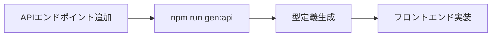

# 🚀 Next.js 15 × Hono API

> **OpenAPI + TanStack Query による型安全なAPI連携構成**

このドキュメントは、Next.js 15とHono APIをOpenAPIスキーマで連携させる最小構成の実装ガイドです。

---

## 📋 目次

- [アーキテクチャ概要](#アーキテクチャ概要)
- [セットアップ手順](#セットアップ手順)
- [開発ワークフロー](#開発ワークフロー)
- [設定ファイル詳細](#設定ファイル詳細)
- [トラブルシューティング](#トラブルシューティング)

---

## 🏗️ アーキテクチャ概要

```
web_app_temp/
├── api/            # Hono + OpenAPI (既存のAPIサーバー)
│   └── src/
│       └── index.ts
└── web/            # Next.js 15 (App Router)
    ├── app/
    ├── lib/
    │   └── api/    # 自動生成される型定義とクライアント
    └── package.json
```

### 技術スタック

| レイヤー | 技術 | 用途 |
|---------|------|------|
| **Backend** | Hono + @hono/zod-openapi | OpenAPIスキーマ付きREST API |
| **Frontend** | Next.js 15 (App Router) | フロントエンドフレームワーク |
| **API Client** | openapi-fetch | 型安全なAPIクライアント |
| **State Management** | TanStack Query | サーバー状態管理 |
| **Type Generation** | openapi-typescript | OpenAPIからTypeScript型生成 |

---

## 🛠️ セットアップ手順

### フロントエンド構築

#### 📦 必要なパッケージをインストール

```bash
cd web
npm install openapi-fetch @tanstack/react-query
npm install -D openapi-typescript
```

#### 📝 package.jsonにスクリプトを追加

```json
{
  "scripts": {
    "dev": "next dev",
    "build": "next build",
    "start": "next start",
    "gen:api": "openapi-typescript http://localhost:3001/api/v1/doc -o ./src/lib/api/schema.d.ts"
  }
}
```

#### 🔧 APIクライアントの設定

**`web/src/lib/api/client.ts`**

```typescript
import createClient from 'openapi-fetch'
import type { paths } from './schema'

export const apiClient = createClient<paths>({
  baseUrl: process.env.NEXT_PUBLIC_API_URL || 'http://localhost:3001/api/v1',
  headers: {
    'Content-Type': 'application/json',
  },
})
```

#### 🪝 React Query フックの作成

**`web/src/lib/api/hooks/useUser.ts`**

```typescript
import { useQuery } from '@tanstack/react-query'
import { apiClient } from '../client'

export const useUser = (userId: string) => {
  return useQuery({
    queryKey: ['user', userId],
    queryFn: async () => {
      const { data, error } = await apiClient.GET('/users/{id}', {
        params: { path: { id: userId } },
      })
      if (error) throw error
      return data
    },
  })
}
```

#### 🎨 React Query Providerの設定

**`web/src/app/providers.tsx`**

```typescript
'use client'

import { QueryClient, QueryClientProvider } from '@tanstack/react-query'
import { ReactQueryDevtools } from '@tanstack/react-query-devtools'
import { useState } from 'react'

export function Providers({ children }: { children: React.ReactNode }) {
  const [queryClient] = useState(
    () =>
      new QueryClient({
        defaultOptions: {
          queries: {
            staleTime: 60 * 1000, // 1分
            refetchOnWindowFocus: false,
          },
        },
      })
  )

  return (
    <QueryClientProvider client={queryClient}>
      {children}
      <ReactQueryDevtools initialIsOpen={false} />
    </QueryClientProvider>
  )
}
```

**`web/src/app/layout.tsx`**

```typescript
import { Providers } from './providers'

export default function RootLayout({
  children,
}: {
  children: React.ReactNode
}) {
  return (
    <html lang="ja">
      <body>
        <Providers>{children}</Providers>
      </body>
    </html>
  )
}
```

#### 📄 使用例

**Server Component での使用**

```typescript
// app/users/[id]/page.tsx
import { apiClient } from '@/lib/api/client'

export default async function UserPage({
  params,
}: {
  params: { id: string }
}) {
  const { data, error } = await apiClient.GET('/users/{id}', {
    params: { path: { id: params.id } },
  })

  if (error) {
    return <div>エラーが発生しました</div>
  }

  return (
    <div>
      <h1>{data.nickname}</h1>
      <p>{data.email}</p>
    </div>
  )
}
```

**Client Component での使用**

```typescript
'use client'

import { useUser } from '@/lib/api/hooks/useUser'

export function UserProfile({ userId }: { userId: string }) {
  const { data, isLoading, error } = useUser(userId)

  if (isLoading) return <div>読み込み中...</div>
  if (error) return <div>エラーが発生しました</div>

  return (
    <div>
      <h1>{data.nickname}</h1>
      <p>{data.email}</p>
    </div>
  )
}
```

---

## 🔄 開発ワークフロー

### 1. 両サーバーを起動

```bash
# ターミナル1
cd api && npm run dev     # http://localhost:3001

# ターミナル2
cd web && npm run dev     # http://localhost:3000
```

### 2. API変更時の型更新

```bash
# APIスキーマから型を再生成
cd web && npm run gen:api
```

### 3. 開発フロー



---

## ⚙️ 設定ファイル詳細

### 環境変数（`web/.env.local`）

```env
# API設定
NEXT_PUBLIC_API_URL=http://localhost:3001/api/v1

# Supabase設定（既存）
NEXT_PUBLIC_SUPABASE_URL=http://127.0.0.1:54321
NEXT_PUBLIC_SUPABASE_ANON_KEY=your_anon_key
```

### Next.js設定（オプション）

APIプロキシを設定する場合：

**`web/next.config.mjs`**

```javascript
/** @type {import('next').NextConfig} */
const nextConfig = {
  async rewrites() {
    return [
      {
        source: '/api/v1/:path*',
        destination: 'http://localhost:3001/api/v1/:path*',
      },
    ]
  },
}

export default nextConfig
```

---

## 🔍 トラブルシューティング

### よくある問題と解決方法

| 問題 | 原因 | 解決方法 |
|------|------|----------|
| 型生成エラー | APIサーバーが起動していない | `cd api && npm run dev` でサーバーを起動 |
| CORS エラー | APIサーバーのCORS設定 | Honoで`cors()`ミドルウェアを追加 |
| 404 エラー | APIパスの不一致 | 環境変数とAPIルートを確認 |

### デバッグツール

- **Swagger UI**: http://localhost:3001/api/v1/ui
- **React Query Devtools**: 開発環境で自動表示
- **Network タブ**: ブラウザの開発者ツール

---

## 📚 参考リンク

- [Hono - Web Framework](https://hono.dev/)
- [OpenAPI TypeScript](https://openapi-ts.dev/)
- [TanStack Query](https://tanstack.com/query/latest)
- [Next.js Documentation](https://nextjs.org/docs)

---

<details>
<summary>📝 元のNext.js README</summary>

This is a [Next.js](https://nextjs.org) project bootstrapped with [`create-next-app`](https://nextjs.org/docs/app/api-reference/cli/create-next-app).

## Getting Started

First, run the development server:

```bash
npm run dev
# or
yarn dev
# or
pnpm dev
# or
bun dev
```

Open [http://localhost:3000](http://localhost:3000) with your browser to see the result.

You can start editing the page by modifying `app/page.tsx`. The page auto-updates as you edit the file.

This project uses [`next/font`](https://nextjs.org/docs/app/building-your-application/optimizing/fonts) to automatically optimize and load [Geist](https://vercel.com/font), a new font family for Vercel.

## Learn More

To learn more about Next.js, take a look at the following resources:

- [Next.js Documentation](https://nextjs.org/docs) - learn about Next.js features and API.
- [Learn Next.js](https://nextjs.org/learn) - an interactive Next.js tutorial.

You can check out [the Next.js GitHub repository](https://github.com/vercel/next.js) - your feedback and contributions are welcome!

## Deploy on Vercel

The easiest way to deploy your Next.js app is to use the [Vercel Platform](https://vercel.com/new?utm_medium=default-template&filter=next.js&utm_source=create-next-app&utm_campaign=create-next-app-readme) from the creators of Next.js.

Check out our [Next.js deployment documentation](https://nextjs.org/docs/app/building-your-application/deploying) for more details.

</details>